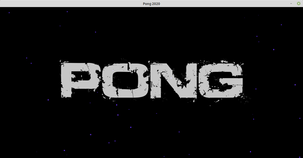
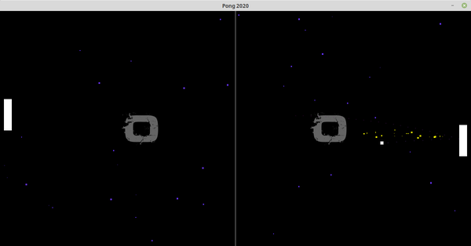

# Pong

Classic Pong game with starfield background and using OpenSimplex random noise to create a 'wind effect' on ball movement that changes smoothly with each hit of the ball on either paddle.

A partical system class handles some nice-looking partical effects.

Written using Python3 and PyGame.

Requires OpenSimplex and PyGame libs. 

>pip install opensimplex
>pip install pygame

or

>pip3 install opensimplex
>pip3 install pygame

## Screenshot

## Controls:

SPACE to start the game.

Tap UP and DOWN keys to accelerate the player paddle up and down.
